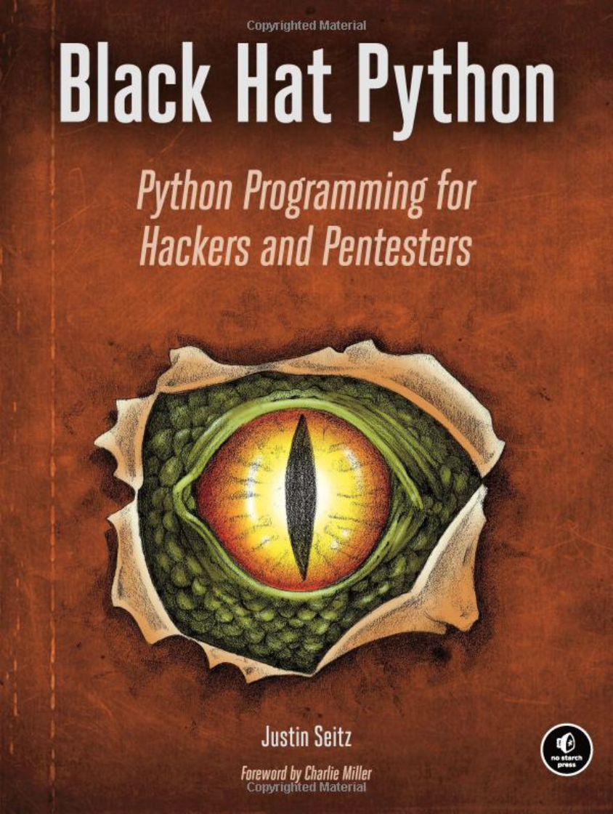

# Black Hat Python — in Ruby

As I'm working my way through **Black Hat Python** (Justin Seitz), I thought it would
be helpful for my own edification to translate the Python code examples into Ruby.
And in case this is interesting/helpful to others, here it is.

## Table of contents (as of 2/15/20)
* [TCP Client](./code_samples/p010_tcp_client.rb)
* [UDP Client](./code_samples/p011_udp_client.rb)
* [TCP Server](./code_samples/p012_tcp_server.rb)
* [Better TCP Server (WIP)](./code_samples/p012a_better_tcp_server.rb)
* [UDP Server](./code_samples/p012b_udp_server.rb)
* [Netcat (WIP)](./code_samples/p013_netcat.rb)
